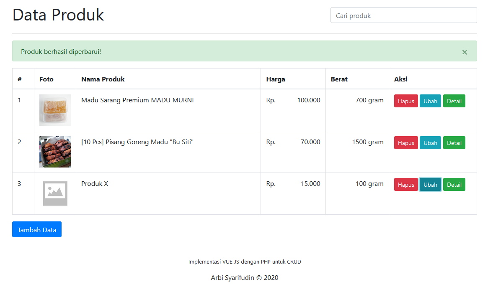

# Implementasi CRUD sederhana menggunakan VUE JS dan PHP

Disini saya mencoba membuat operasi CRUD (create, read, update, delete) sederhana menggunakan **VUE JS** dan **AXIOS** serta dibantu oleh **PHP** sebagai backend untuk berkomunikasi dengan **MYSQL**.

### SCREENSHOT :

Silakan bisa teman-teman download dan pelajari sendiri sebagai sarana pengenalan terhadap **VUE JS**; salahsatu framework javascript terkeren abad ini. :smile: Hehehe
